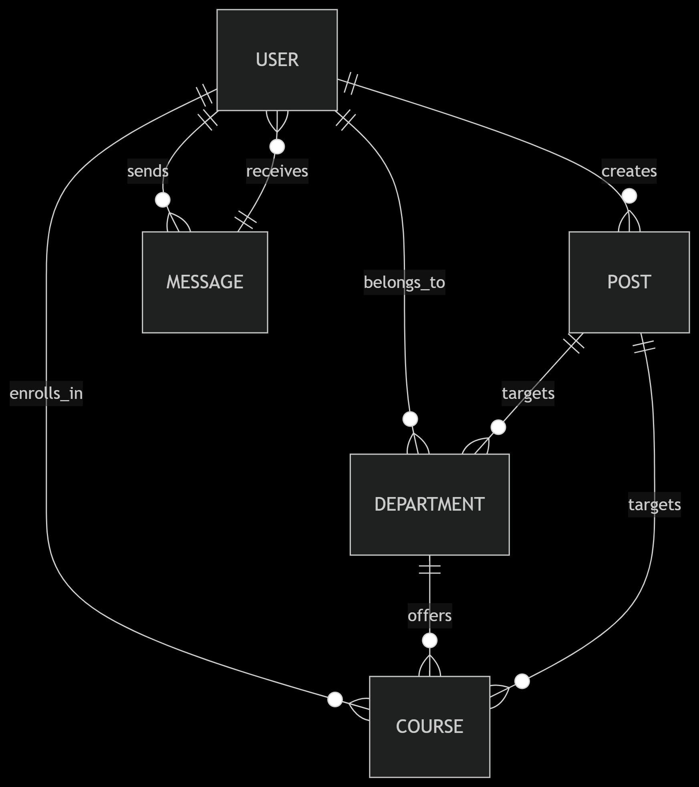

# IVACK University Portal

A centralized university portal designed to unify **academic communication**, **content delivery**, and **department/course collaboration**.  
Built with **Django**, deployed on **Render**, and optimized with **Cloudinary** for media delivery.

---

## 📌 Problem Statement

**What problem are we solving?**  
The IVACK University Portal replaces fragmented channels (emails, physical notices, ad-hoc drives) with a **single portal** that delivers:
- Targeted posts  
- Direct messaging  
- Optimized media resources  

**Who are the users?**
- **Students**: access materials, submit assignments, view grades, communicate with faculty.  
- **Professors/Faculty**: distribute content, announcements, and manage communication.  
- **Visitors/Prospective Students**: discover programs, admissions info, and reach departments.  

**Goals**
- Centralized, secure, mobile-friendly portal.  
- Targeted posts to courses/departments.  
- Messaging and media delivery.  
- Scalable infra with **PaaS (Render)**.  

**Non-Goals**
- No full LMS replacement (grading/reporting).  
- No payments or complex external integrations at launch.  

---

## ✅ Requirements

### Functional
- Create, edit, delete **posts** (institution, department, course, or custom groups).  
- Role-based access (students, faculty, admin, visitor).  
- One-to-one and group messaging.  
- Media uploads and secure delivery.  
- Course enrollment views & course feeds.  
- Public-facing pages for prospective students.  
- RESTful APIs for mobile/app integration.  

### Non-Functional
- **Scalability**: from 100s → 10k+ users.  
- **Availability**: 99.9% uptime, automated DB backups.  
- **Performance**: <2s load time, CDN-backed media.  
- **Security**: HTTPS, RBAC, CSRF/XSS protection, secure file handling.  
- **Cost Efficiency**: Managed PaaS + Cloudinary.  

---

## 🏗️ High-Level Architecture

- **Frontend**: Django templates + Bootstrap 5 + jQuery.  
- **Backend**: Django monolith (apps: accounts, departments, courses, posts, messaging, results).  
- **Database**: PostgreSQL 16 (managed).  
- **Static Files**: WhiteNoise (compressed + hashed).  
- **Media**: Cloudinary (CDN, on-the-fly transforms).  
- **Hosting**: Render (scalable PaaS).  
- **Future Real-Time**: Django Channels + Redis (WebSockets).  

---

## 🧩 Component Design

**Frontend / UI**  
- Responsive Bootstrap 5 templates, progressive enhancement with jQuery.  

**API Layer**  
- Django REST endpoints for posts, messaging, courses, users.  
- Secured with tokens / sessions.  

**Service Layer**  
- Modular Django apps (accounts, departments, courses, posts, messaging, results).  

**Data Storage**  
- PostgreSQL (normalized schema).  
- JSONB for flexible metadata.  

**Cache Layer**  
- WhiteNoise + Cloudinary CDN.  
- Future: Redis/Django caching.  

**Async Processing**  
- Not needed yet; plan for Channels & workers later.  

**3rd-Party Integrations**  
- Cloudinary for media management.  

---

## 📊 Data Model

Core Entities: **User, Department, Course, Post, Message**.  

**Explanation**  
- **User**: students, professors, visitors. Personalized feeds based on enrollments.  
- **Post**: scoped to institution/department/course.  
- **Message**: one-to-one or group chats.  
- **Department / Course**: organize access & targeting.  

---

## ⚖️ Scaling & Reliability

- **Web Scaling**: Render autoscaling, Gunicorn tuning (workers = 2 × CPUs + 1).  
- **Static/Media Offload**: WhiteNoise + Cloudinary CDN.  
- **Database**: PostgreSQL with backups, future replicas/sharding.  
- **Failover/Recovery**: Health checks, restart policies, DB point-in-time recovery.  

---

## 🔐 Security & Privacy

- **Transport**: HTTPS via Render-managed TLS + Cloudinary HTTPS.  
- **Auth**: Custom Django User (RBAC).  
- **Django Security**: CSRF tokens, XSS protection, ORM safety, PBKDF2/Argon2 hashing.  
- **Secrets**: Env variables (never committed).  
- **Uploads**: Cloudinary `resource_type=raw` for safe file handling.  
- **Logging**: No PII in logs, admin-only access.  

---

## 📈 Monitoring & Observability

- **Logs**: Django + Gunicorn → Render log viewer.  
- **Metrics**: Render dashboards + Postgres monitoring + Cloudinary usage.  
- **Health Checks**: Render readiness/liveness endpoints.  
- **Alerts**: Notifications for downtime & DB thresholds.  
- **Tracing**: Request ID middleware, slow query logging.  

---

## 🔄 Trade-offs & Alternatives

- **Render vs AWS/Heroku**: simplicity > low-level control.  
- **Cloudinary vs DIY storage**: costs > complexity.  
- **WhiteNoise vs CDN**: simple for now; CDN later if needed.  

---

## 🚀 Future Considerations

- Real-time: WebSockets via Django Channels + Redis.  
- Enhanced observability: structured logging, tracing, monitoring tools.  
- Database scaling: replicas, partitioning, sharding.  
- Application caching: Redis for hot reads.  

---

## 🛠️ Tech Stack

- **Framework**: Django (Python)  
- **Frontend**: Bootstrap 5, jQuery  
- **Database**: PostgreSQL 16  
- **Static**: WhiteNoise  
- **Media**: Cloudinary  
- **Hosting**: Render (PaaS)  
- **Future**: Django Channels + Redis  

---

## 👥 Contributors

- **Project Lead**: Derrickl Omondi  
- Faculty & student feedback from IVACK pilot departments.
